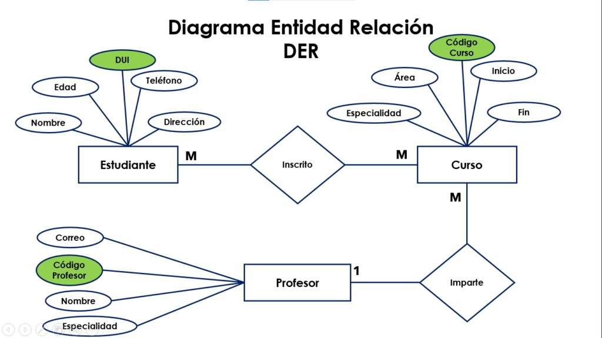

# Exemple pràctic

## Acadèmia de cursos

Exemple d’un sistema format per:

- Estudiants
- Professors
- Cursos

## Relacions

- Un professor imparteix diversos cursos.
- Un estudiant pot inscriure’s en diversos cursos.



## Exemple de transformació a SQL

```sql
CREATE TABLE estudiants (
    id_estudiant INT PRIMARY KEY,
    nom VARCHAR(50) NOT NULL,
    email VARCHAR(100) UNIQUE
);

CREATE TABLE cursos (
    id_curs INT PRIMARY KEY,
    nom VARCHAR(100) NOT NULL
);
```