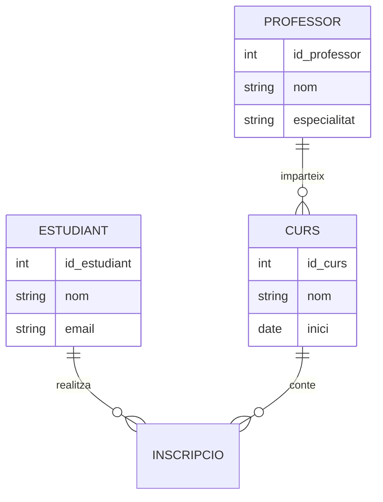

# Relacions

## Relacions entre entitats

Les relacions indiquen com interactuen les entitats.

## Tipus de cardinalitat

### 1:1

Una entitat es relaciona amb una única altra entitat.

### 1:N

Una entitat es relaciona amb múltiples entitats.

### N:M

Múltiples entitats es relacionen entre si.

## Diagrama Mermaid

